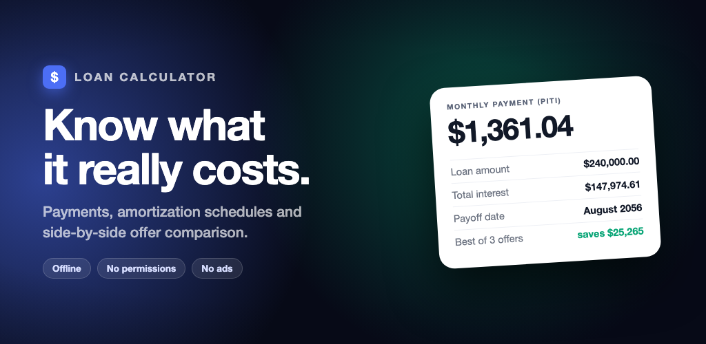
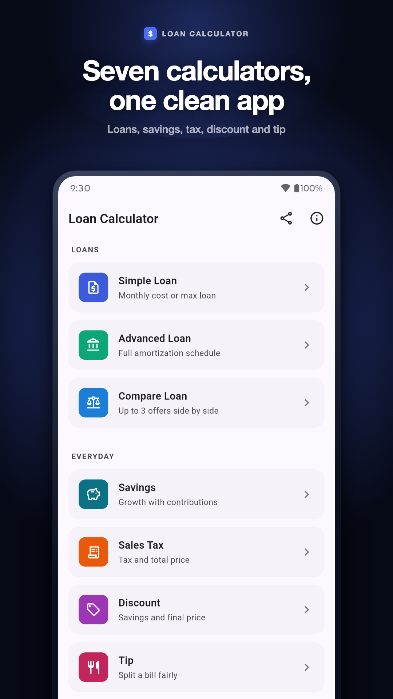
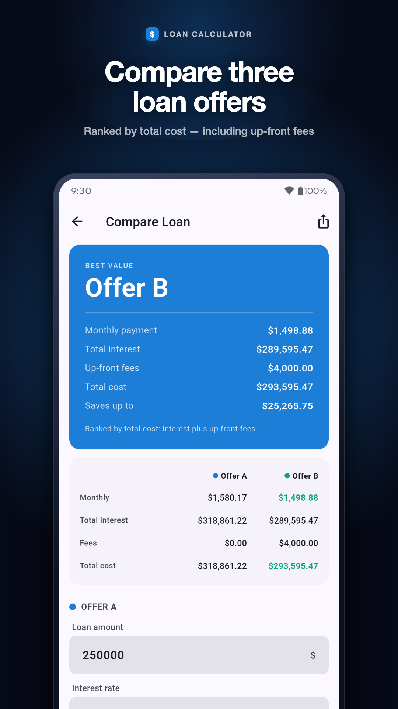
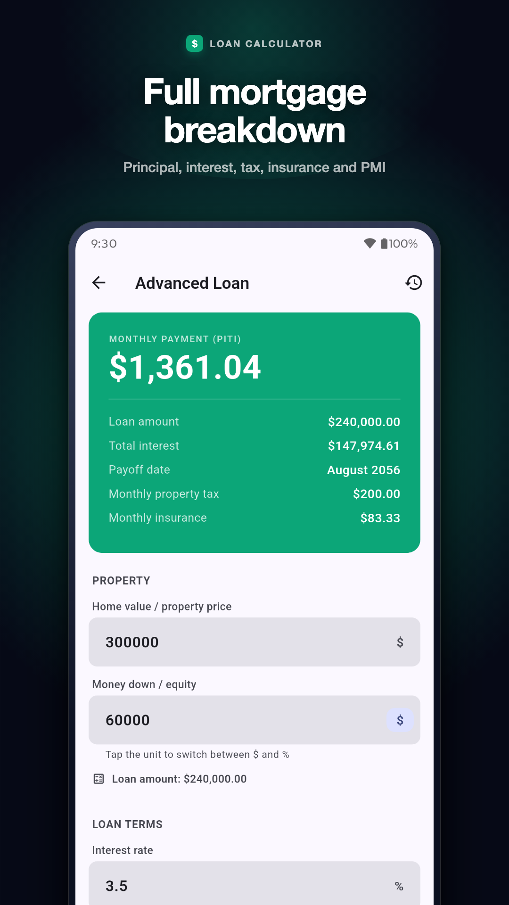
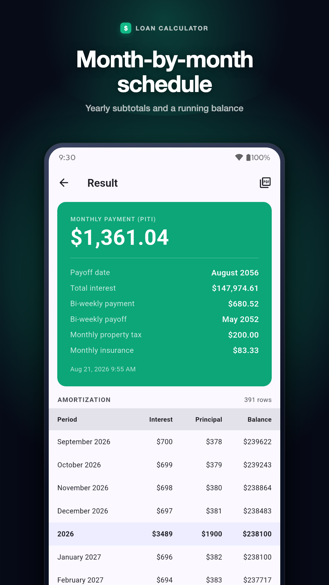
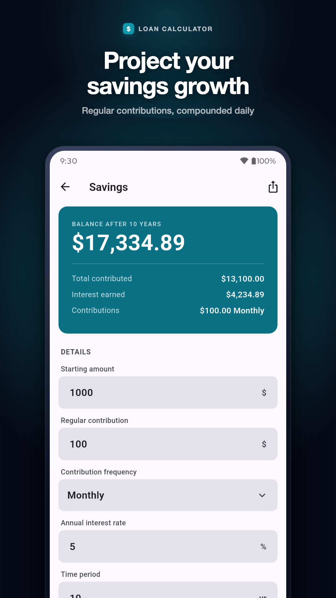
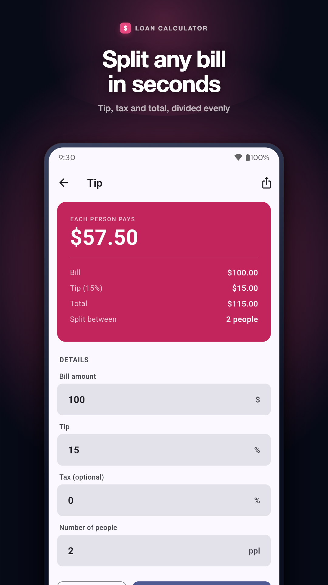

# Loan Calculator

<p align="center">
  
</p>

<p align="center">
  <strong>A modern, offline financial suite built with Flutter. Calculate loan payments, view detailed amortization schedules, compare loan terms, and plan savings — with complete privacy.</strong>
</p>

<p align="center">
  
  
  
  
  
</p>

---

## 📱 Screenshots

<div align="center">
  <table>
    <tr>
      <td align="center" width="33%">
        <br />
        <b>Calculators Hub</b>
      </td>
      <td align="center" width="33%">
        <br />
        <b>Compare Terms Side by Side</b>
      </td>
      <td align="center" width="33%">
        <br />
        <b>Advanced Mortgage Breakdown</b>
      </td>
    </tr>
    <tr>
      <td align="center" width="33%">
        <br />
        <b>Amortization Schedule</b>
      </td>
      <td align="center" width="33%">
        <br />
        <b>Compound Savings Growth</b>
      </td>
      <td align="center" width="33%">
        <br />
        <b>Everyday Tip & Bill Splitter</b>
      </td>
    </tr>
  </table>
</div>

---

## ✨ Features

### 1. 📊 Simple Loan & Affordability
- **Two calculation modes**:
  - Calculate regular monthly repayment amounts from loan principal, interest rate, and term.
  - Inverse calculation: Determine the **maximum loan principal** you can afford given your monthly budget.
- Live breakdowns for total interest payable and total cost over the loan lifetime.

### 2. 🏡 Advanced Loan & Mortgage Breakdown
- Detailed mortgage calculations including:
  - Principal & interest
  - Property taxes
  - Homeowner's insurance
  - Private Mortgage Insurance (PMI) applied automatically when deposit is under 20%
- Toggle down payment input between fixed currency amount or percentage.
- Full month-by-month **amortization schedule** with yearly subtotals.
- Save calculations locally on-device and reopen past estimates anytime.

### 3. ⚖️ Compare Loan Terms Side-by-Side
- Compare up to three loan sets simultaneously.
- Ranks offers by **true total cost** (interest + upfront arrangement fees).
- Immediately identifies lowest monthly payment vs lowest overall cost, showing the exact savings difference.

### 4. 📈 Compound Savings Calculator
- Project savings growth from an initial deposit plus recurring contributions.
- Configurable frequency: weekly, bi-weekly, monthly, quarterly, or annually.
- Visual breakdown of your total principal contributions vs compound interest earned.

### 5. 🧮 Everyday Utility Calculators
- **Sales Tax**: Calculate net price, tax amount, and gross total.
- **Discount**: Calculate final sale price and total amount saved with optional tax handling.
- **Tip & Bill Splitter**: Calculate tips and split totals evenly across any number of party members.

### 6. 📄 Export & Sharing
- Export detailed amortization reports directly to formatted **PDF**.
- In-app PDF preview with native **print** and **share sheet** support.
- Export result summary cards as images directly into messaging or notes apps without requiring external storage permissions.

---

## 🔒 Privacy & Security by Design

- **Zero Device Permissions**: Requires no storage, camera, contacts, location, SMS, or advertising IDs.
- **100% Offline**: Calculations execute purely locally on your device. No user data ever leaves the phone.
- **No Tracking & No Ads**: Clean codebase free from ad SDKs, analytics tracking, or accounts/login walls.

---

## 🛠️ Architecture & Tech Stack

- **Framework**: [Flutter](https://flutter.dev) (Dart 3.9+)
- **Design System**: Material Design 3 with dynamic light and dark theme modes
- **Local Storage**: [Hive CE](https://pub.dev/packages/hive_ce) for high-performance offline persistence
- **Document Generation**: [pdf](https://pub.dev/packages/pdf) & [printing](https://pub.dev/packages/printing)
- **Sharing**: [share_plus](https://pub.dev/packages/share_plus) & [screenshot](https://pub.dev/packages/screenshot)
- **Math Engine**: Fully isolated domain calculation layer in [`lib/domain/loan_math.dart`](lib/domain/loan_math.dart) covered by unit tests.

---

## 🚀 Getting Started

### Prerequisites
- [Flutter SDK](https://docs.flutter.dev/get-started/install) (`>= 3.9.0`)
- Android Studio / VS Code with Flutter extension
- Android SDK (`targetSdk: 36`, `minSdk: 24`) or Xcode for iOS development

### Installation

1. **Clone the repository**:
   ```bash
   git clone https://github.com/imamhossain94/loan-calculator.git
   cd loan-calculator
   ```

2. **Install dependencies**:
   ```bash
   flutter pub get
   ```

3. **Run unit tests**:
   ```bash
   flutter test
   ```

4. **Launch the application**:
   ```bash
   flutter run
   ```

### Building for Production

- **Android App Bundle (AAB)**:
  ```bash
  # Copy example signing config (optional for debug, required for Play Store release)
  cp android/key.properties.example android/key.properties
  # Fill in keystore parameters in android/key.properties

  flutter build appbundle --release
  ```

- **Android APK**:
  ```bash
  flutter build apk --release
  ```

---

## 📜 Disclaimer

This application is designed for educational and informational estimation purposes only. It does not provide, arrange, broker, or facilitate loans, mortgages, or financial services. All figures are mathematical projections based solely on user inputs.
